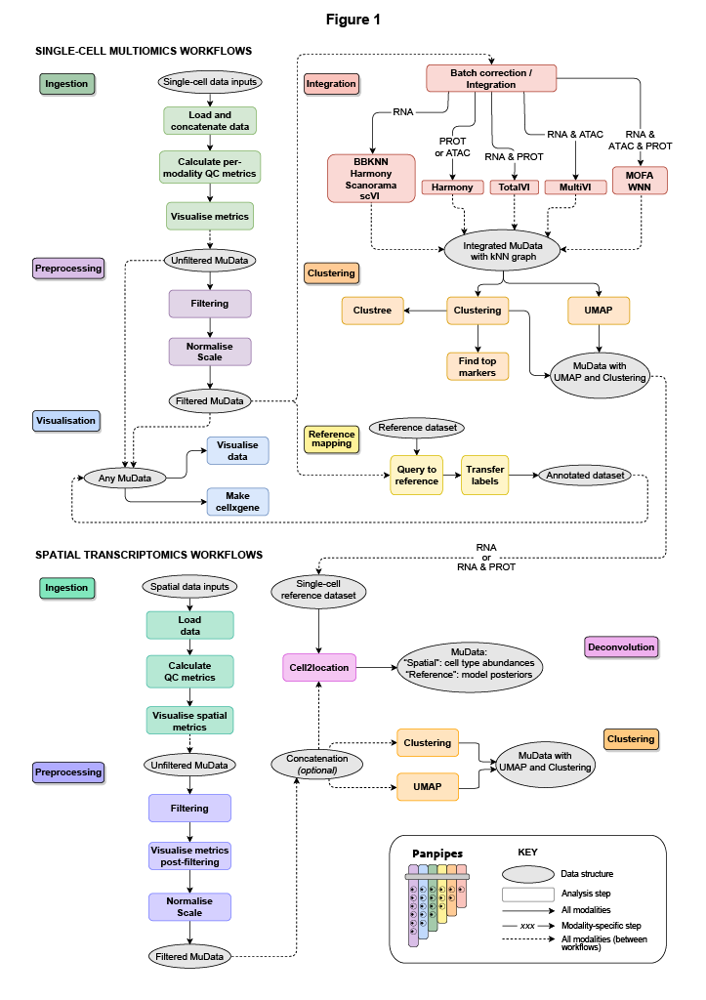

Panpipes - multimodal single cell pipelines 
==================================================

| `Check out our preprint: <https://www.biorxiv.org/content/10.1101/2023.03.11.532085v1>`_ 
| **Panpipes: a pipeline for multiomic single-cell data analysis**  
| Charlotte Rich-Griffin, Fabiola Curion, Tom Thomas, Devika Agarwal, Fabian J. Theis, Calliope A. Dendrou. https://doi.org/10.1101/2023.03.11.532085

What is panpipes?
-----------------

Panpipes is a collection of cgat-core/ruffus pipelines to streamline the analysis of multi-modal single cell data.
Panpipes supports any combination of the following single-cell modalities: scRNAseq, CITEseq, scV(D)Jseq, and scATACseq

Check out the :doc:`installation<install>` and :doc:`usage guidelines<usage/index>` page for further information.

Available pipelines for Multimodal Data:
--------------------

1. :doc:`workflows/qc` : for the ingestion of data and computation of QC metrics' 
2. :doc:`workflows/preprocess` : for filtering and normalising of each modality
3. :doc:`workflows/integration`: integrate and batch correction using  single and multimodal methods
4. :doc:`workflows/clustering` : cell clustering on single modalities
5. :doc:`workflows/refmap` : transfer scvi-tools models from published data to your data
6. :doc:`workflows/vis` : visualise metrics from other pipelines in context of experiment metadata

Available Pipelines for Spatial Data:
-----

1. :doc:`workflows/ingest_spatial` :  for the ingestion of Spatial and RNA data and computation of QC metrics
2. :doc:`workflows/preprocess_spatial`: for filtering and normalising spatial data
3. :doc:`workflows/deconvolute_spatial` : for deconvoluting spatial data with `cell2location`
4. :doc:`workflows/clustering_spatial` : for clustering spatial data

Contents
--------

.. toctree::
   :maxdepth: 1

   install
   usage/index
   workflows/index
   tutorials/index
   release_notes
   contributors
   references

