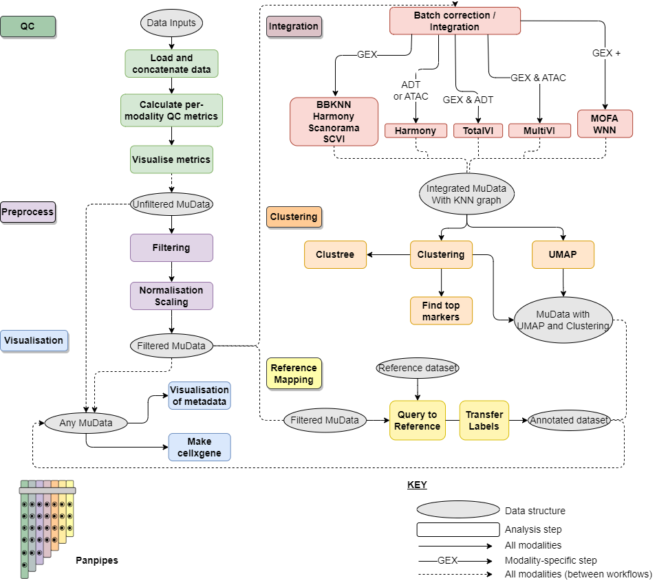

Panpipes - multimodal single cell pipelines 
==================================================

| `Check out our preprint: <https://www.biorxiv.org/content/10.1101/2023.03.11.532085v1>`_ 
| **Panpipes: a pipeline for multiomic single-cell data analysis**  
| Charlotte Rich-Griffin, Fabiola Curion, Tom Thomas, Devika Agarwal, Fabian J. Theis, Calliope A. Dendrou. https://doi.org/10.1101/2023.03.11.532085

What is panpipes?
-----------------

Panpipes is a collection of cgat-core/ruffus pipelines to streamline the analysis of multi-modal single cell data.
Panpipes supports any combination of the following single-cell modalities: scRNAseq, CITEseq, scV(D)Jseq, and scATACseq

Available pipelines:

1. :doc:`components/qc` : for the ingestion of data and computation of QC metrics' 
2. :doc:`components/preprocess`: for filtering and normalising of each modality
3. :doc:`components/integration`: integrate and batch correction using  single and multimodal methods
4. :doc:`components/clustering` : cell clustering on single modalities
5. :doc:`components/refmap` : transfer scvi-tools models from published data to your data
6. :doc:`components/vis` : visualise metrics from other pipelines in context of experiment metadata

Check out the :doc:`usage` page for further information, including
how to :doc:`install<install>` the project.

Contents
--------

.. toctree::
   :maxdepth: 1

   usage
   components/specifications
   tutorials
   install
   api
   release_notes
   contributors
   references
   components

