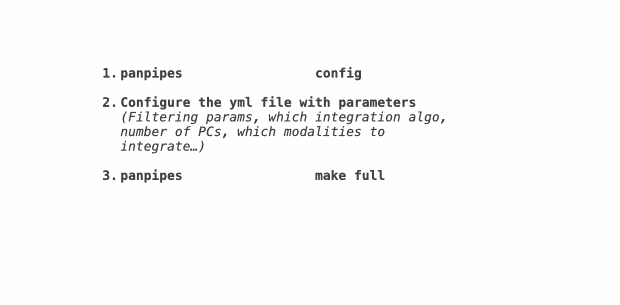

# General principles for running panpipes 

Panpipes is a single cell multimodal analysis pipeline with a lot of functionalities to streamline and speed up your single cell projects.

Panpipes can be run on a local computer or on an HPC cluster. On an HPC cluster, panpipes can be launched from the login node on your server, it will use the built the job submission scheduling system to submit jobs.
To prevent jobs being cancelled when you log out, we recommend using either the `nohup` command, or a terminal multiplexer such a [tmux](https://github.com/tmux/tmux/wiki) or [screen](https://www.gnu.org/software/screen/manual/screen.html).

To aid with project management, we suggest creating directories for projects where one or multiple samples can be analysed with the same choice of parameters, and optionally integrated in the same latent space for downstream analyses.
In our notation, a **sample** is constituted of all the cells that were in the same tube and generated a *sequencing library*. A sample can be a 10X channel or lane.

For example, you have generated 4 samples as part of a pilot experiment, and you want to use consistent processing choices and use batch integration methods.
Or you have used genetic or hashing single cell multiplexing to mix *donors* or *specimens* in the same sample. 

In panpipes, each sample belonging to the same project is *ingested* into a multimodal container, [`MuData`](https://github.com/scverse/mudata).
Multi-sample single cell suspensions experiments are concatenated in the same `MuData`.
For multimodal experiments, `MuData` layers are populated, namely `rna`, `prot`,`atac`, `tcr`, `bcr`.

## Interacting with workflows

All the workflows included in panpipes require to be initialized with a config file.

    panpipes ingest config

This command will produce two files, `pipeline.log` and `pipeline.yml`
The pipeline.yml is the config file that stores all the parameters for the workflow you intend to run, and needs to be customized for the analysis.

All panpipes workflows follow the same principle to be run:

    panpipes **NAME_OF_WORKFLOW** make full



## Starting your project

Navigate to the directory where you want to run your analysis (this should not be within the panpipes folder,
or your virtual environment folder, but a separate directory),

```bash
    mkdir teaseq
    cd teaseq
```

The `ingestion` is the first entry point to panpipes so we will use this as an example of user interaction with panpipes.

Prepare a [sample submission file](setup_for_qc_mm) that stores all the samples you want to analyse together and that will be used by the `ingestion` to locate the inputs.

Initialize the workfow with a configuration file

```bash
    panpipes ingest config
```

This command will produce two files, `pipeline.log` and `pipeline.yml`. Edit this file as appropriate for your data, following the instructions within the yml file and the instructions provided in the [workflows section](../workflows).

## Check workflows steps

You can check which jobs will run with the command

```bash
    panpipes ingest show full
```

The output of this will show a list of tasks that will be run as part of
the pipeline.


This command, invoked after configuring the workflow, will show all the tasks that need to be completed for the pipeline to reach completion (the `full` task is the final task)

Occasionally you might want to run tasks individually (e.g.to assess
outputs before deciding the parameters for the next step) In order to do
this you can run any task in the `show full` list such as:

```bash
    panpipes ingest make plot_tenx_metrics
```

The `show` command can be invoked also at intermediate stopping points, to show which tasks are still pending to get to the desired task.

## Run the workflow

To run each of the workflows, use the command

    panpipes ingest make full

The workflow will print to stdout and write to `pipeline.log` what tasks it's running and duration of each step.
When it's completed, you will find a message informing you it's done, like this one:

    2023-11-22 19:09:16,036 INFO main task - Completed Task = 'pipeline_clustering.cleanup' 
    2023-11-22 19:09:16,037 INFO main task - Task enters queue = 'pipeline_clustering.full' 
    2023-11-22 19:09:16,143 INFO main control - {"task": "'pipeline_clustering.full'", "task_status": "completed", "task_total": 0, "task_completed": 0, "task_completed_percent": 0}
    2023-11-22 19:09:16,142 INFO main task - Completed Task = 'pipeline_clustering.full' 
    2023-11-22 19:09:16,322 INFO main experiment - job finished in 631 seconds at Wed Nov 22 19:09:16 2023 -- 11.02  3.20 1863.75 346.51 -- 7eeccbb4-e7ba-41d4-a760-0e5d640b648a

## Final notes

All panpipes workflow follow these general principles, with specific custom parameters and input files for each workflow.
See the [Worflows](https://panpipes-pipelines.readthedocs.io/en/latest/workflows/index.html) section for detailed info on each workflow and check out our [Tutorials](https://panpipes-pipelines.readthedocs.io/en/latest/tutorials/index.html) for more examples.
