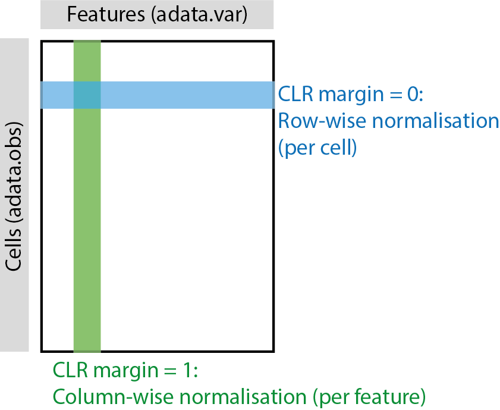

Normalization methods
=======================

panpipes currently supports the following normalization methods:

## RNA

1. Standard normalization using scanpy's [normalize_total](https://scanpy.readthedocs.io/en/stable/generated/scanpy.pp.normalize_total.html) and [log1p](https://scanpy.readthedocs.io/en/stable/generated/scanpy.pp.log1p.html).

Additionally, the normalized data can be scaled using scanpy's [sc.pp.scale](https://scanpy.readthedocs.io/en/stable/generated/scanpy.pp.scale.html)

## PROT

1. clr using [muon's prot processing](https://muon.readthedocs.io/en/latest/api/generated/muon.prot.pp.html), with the option to specify margin for normalization,
   1. clr margin= 0, normalize within each cells' counts distribution, across all features (row-wise, as you would do for RNA data)
   2. clr margin= 1, normalize within each feature's distribution, across all cells (column-wise, recommended for proteomics data)

    *if you come from R, please note that the [margins are transposed](https://images.hindustantimes.com/rf/image_size_630x354/HT/p2/2017/09/21/Pictures/_78c6a162-9e94-11e7-9c3b-8e901839ece0.JPG) in the Python and anndata world*

   

2. dsb using [muon's prot processing](https://muon.readthedocs.io/en/latest/api/generated/muon.prot.pp.html). This method is only applicable when you have raw 10x inputs (see [supported input files](https://panpipes-pipelines.readthedocs.io/en/latest/usage/setup_for_qc_mm.html#supported-input-filetypes)).

## ATAC

1. Standard normalization using scanpy's [normalize_total](https://scanpy.readthedocs.io/en/stable/generated/scanpy.pp.normalize_total.html) and [log1p](https://scanpy.readthedocs.io/en/stable/generated/scanpy.pp.log1p.html).
2. TFIDF with 3 flavours
   1. "signac", following [signac's defaults](https://stuartlab.org/signac/articles/pbmc_vignette#normalization-and-linear-dimensional-reduction).
    using [muon's atac processing](https://muon.readthedocs.io/en/latest/api/generated/muon.atac.pp.tfidf.html#muon.atac.pp.tfidf) 
   2. "logTF": logging the TF term using using [muon's atac processing](https://muon.readthedocs.io/en/latest/api/generated/muon.atac.pp.tfidf.html#muon.atac.pp.tfidf) 
   3. "logIDF": logging the IDF term using using [muon's atac processing](https://muon.readthedocs.io/en/latest/api/generated/muon.atac.pp.tfidf.html#muon.atac.pp.tfidf) 

## Layers nomenclature within each modality

Raw, Normalised and Scaled data are saved for each modality in their specific layers:

    atac.layers["logTF_norm"] = atac.X.copy()

Using the following nomenclature:

| method                 | layer           | modality      |
| ---------------------- | --------------- | ------------- |
| raw counts             | "raw_counts"    | RNA/ATAC/PROT |
| standard log1p         | "logged_counts" | RNA or ATAC   |
| scaled counts          | "scaled_counts" | RNA or ATAC   |
| clr                    | "clr"           | PROT          |
| dsb                    | "dsb"           | PROT          |
| TFIDF (signac flavour) | "signac_norm"   | ATAC          |
| TFIDF (logTF)          | "logTF_norm"    | ATAC          |
| TFIDF (logIDF)         | "logIDF_norm"   | ATAC          |
