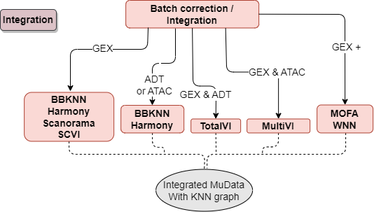

Integration
===========

The panpipes integration pipeline implements a variety of tools to batch correct individual modalities and/or integrate across modalities to produce a reduced dimension representation of the dataset.

The flowchart indicates which tools are available for each modality out of RNA (also referred to as GEX), PROT (also referred to as ADT) and ATAC. You can run as many of these tools as you choose and then you can run `panpipes integration make merge_batch_correction` to create a final object containing one reduced dimension representation and one nearest neighbor graph per modality. This can be used as input to the clustering pipeline.

## Steps to run:

1.  In a new folder, generate config file for integration,
    `panpipes integration config` and edit the pipeline.yml file.
2.  Run batch correction with
    `panpipes integration make batch_correction` (or run all corrections
    in one go with `panpipes integration make full`)
3.  Use pipeline outputs to decide on the best batch correction method
4.  Edit the integration pipeline yml with your preferred batch
    correction
5.  Run `panpipes integration make merge_correction`

## Expected structure of MuData object
The ideal way to run `panpipes integration` is to use the output mudata file from `panpipes preprocess`, as this will make sure the MuData object has correctly names layers and slots. 

The bare minimum MuData object required is normalised data in the X slot of each modality,  a 'raw_counts' layer in each modality, and a sample_id column in each slot of the obs and the outer obs. A plus is a PCA in the obsm slot for each modality, if not it will be calculated on the flight with default parameters.
