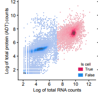

QC
==

## Pipeline steps for all modalities:

Panpipes `ingest` loads and concatenates data from a variety of [filetype inputs](../usage/setup_for_qc_mm).
Panpipes creates a mudata object containing the data in assays called 'rna', 'prot', 'atac', and 'rep'. See the [mudata documentation](https://mudata.readthedocs.io/en/latest/) for more details on interactively accessing these data.

Feature names will be forced to be unique. This means that protein assay names will be prefixed with 'prot_'

Then qc metrics are computed using [scanpy.pp.calculated_qc_metrics](https://scanpy.readthedocs.io/en/stable/generated/scanpy.pp.calculate_qc_metrics.html). Total counts per cell and total features per cell, are computed as standard, but the gene scores are completely customisable as described in the [gene list format page](../usage/gene_list_format). These metrics are plotted as violin plots, and scatters.


### RNA QC steps
- Per cell QC metrics computed
- Doublet scores are computed with [scrublet](https://github.com/swolock/scrublet)
- cell cycle phases is inferred per cell with [sc.tl.score_genes_cell_cycle](https://scanpy.readthedocs.io/en/stable/generated/scanpy.tl.score_genes_cell_cycle.html)


### Prot QC steps
- Protein metadata such as isotype status or shorter names incorporated into the object. Inputs for this are described [here]
- Per cell QC metrics computed as described above, including pct_isotype where isotype information is available. 
- Per Protein metrics, total_counts, and are computed, in order to compare the binding of different antibodies (applicable when your assay is CITE-seq based). These are defined in the yml:
`prot_metrics_per_adt: total_counts,log1p_total_counts,n_cells_by_counts,mean_counts`
- A rudimentary check for cells that are 'isotype' outliers, i.e. the cells where the isotype content is in the top 10% quantile for more than 2 isotypes. (these parameters are customisable in the`pipeline.yml`). See the function [here](https://github.com/DendrouLab/panpipes/blob/main/panpipes/funcs/scmethods.py#L328). 
```
# isotype outliers: one way to determine which cells are very sticky is to work out which cells have the most isotype UMIs
# associated to them, to label a cell as an isotype outlier, it must meet or exceed the following crietria:
# be in the above x% quantile by UMI counts, for at least n isotypes 
# (e.g. above 90% quantile UMIs in at least 2 isotypes)
identify_isotype_outliers: True
isotype_upper_quantile: 90
isotype_n_pass: 2
```
- Finally, the normalisation is assessed on a per channel basis (default: the sample_id column). This is either CLR or DSB normalisation. Importantly this normalised data is not saved in the mudata object, by default it is just visualised. It's purpose is to check that the staining has been consistent across your channels and whether there are prominent batch effects. The normalised data can be saved by setting `save_norm_prot_mtx` to True, and each normalised channel with be saved separately as mtx files.


### ATAC QC steps
QC for atac includes some modality specific metrics computation, namely:
- TSS (transcription start site) enrichment is computed with [mu.atac.tl.tss_enrichment](https://muon.readthedocs.io/en/latest/api/generated/muon.atac.tl.tss_enrichment.html)
- Percent fragments in peaks 
- Number of mitochondrial reads per cell
Please note that differently from what happens with other modalities,  `panpipes ingest` expects one multiome sample at the time, since concatenating different peak-callings may result in unwanted artefacts. Please check the cellranger documentation on how to aggregate multiple atac runs before using panpipes.
  

### Repertoire (Rep) QC Steps
- Using the [scirpy](https://scirpy.scverse.org/en/stable/index.html) library (v.0.12.0), the chains are qc'd with [scirpy.tl.chain_qc](https://scirpy.scverse.org/en/stable/generated/scirpy.tl.chain_qc.html)
- Clonotypes are defined with [scirpy.pp.ir_dist](https://scirpy.scverse.org/en/stable/generated/scirpy.pp.ir_dist.html) and [scirpy.tl.define_clonotypes](https://scirpy.scverse.org/en/stable/generated/scirpy.tl.define_clonotypes.html) and [scirpy.tl.clonal_expansion](https://scirpy.scverse.org/en/stable/generated/scirpy.tl.clonal_expansion.html)


### Assessing background
There is an additional optional `assess_background` step, if the raw data (includeing empty drops) is available. This is primarily of use when you have RNA and Protein modalities.

- plot the barcode rank plots for each sample_id (rna modality). 
- scatter plots to compare distributions of foreground and background of rna and prot 

- quantify and plot the top expressed features (rna and prot) in the empty droplets. This can reveal potential contamination and batch effects in your data.

## Steps to run:

1.  Generate sample submission file as described in
    [Inputs to Multimodal QC pipeline](../setup_for_qc_mm)
2.  Generate qc genelists as described in
    [Gene list format](../gene_list_format)
3.  For adt assay - generate the protein metadata file
    [example]((https://github.com/DendrouLab/panpipes/blob/main/resources/protein_metadata_w_iso.md)).
    This file is integrated into the mdata\['prot'\].var slot.
4.  Generate config file (`panpipes ingest config`)
5.  Edit the pipeline.yml file for your dataset
    -   this is explained step by step within the pipeline.yml file
6.  Run complete qc pipeline with `panpipes ingest make full`
7.  Use outputs to decide filtering thresholds.
    -   **Note that the actual filtering occurs in the first step of
        Preprocess pipeline**
    -   TODO: create doc to explain the pipeline outputs

The h5mu file outputted from `ingest` contains concatenated raw counts
from all samples in the submission file, plus qc metrics are computed,
and these qc metrics are visualised in a variety of plots to aid the
user to determine data quality and filtering thresholds.
